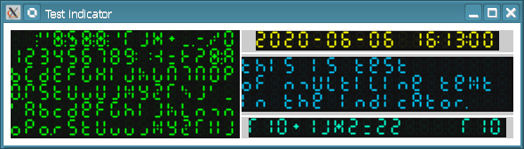
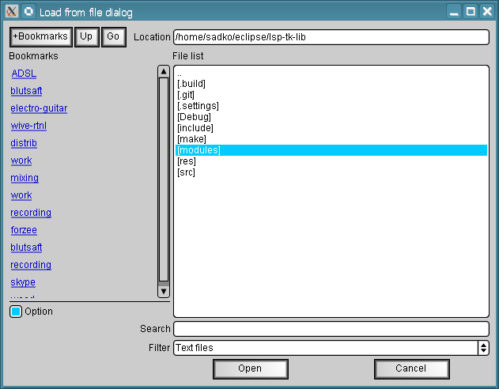
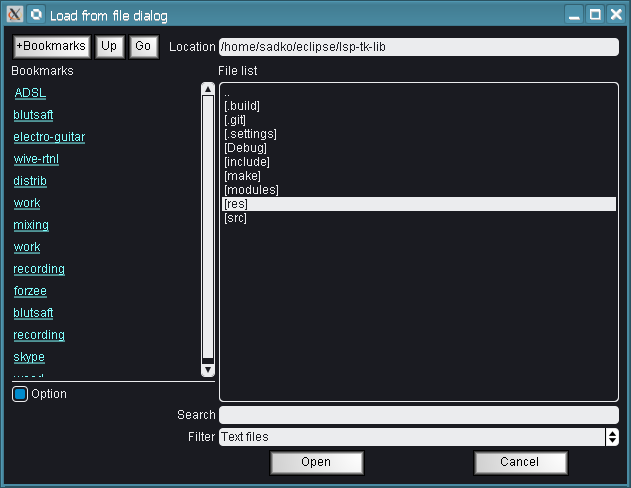
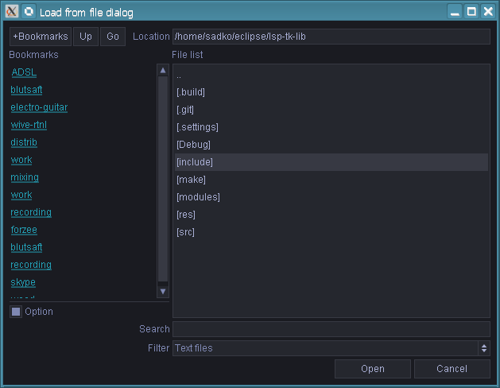
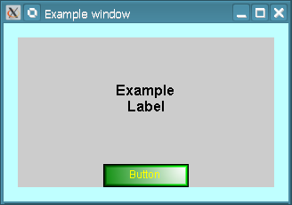
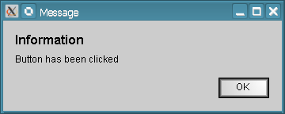

# lsp-tk-lib

Graphical toolkit library used by Linux Studio Plugins Project.



## Key features

* Supported platforms:
  * FreeBSD (X11/Cairo);
  * GNU/Linux (X11/Cairo);
  * Windows (WinAPI/D2D1).
* Pretty leightweight, only about 2 MB of compiled code.
* Almost minimum global state (used only in case when underlying API requires global variables),
  all operations are performed on `tk::Display` main object and objects derived from `tk::Widget`.
  This makes possible to have multiple versions of library for instances in the same runtime under
  certain circumstances.
* Basic styling support. Style schema can be loaded from the XML file and updated in runtime.
* Automatic space and widget layout allocation.
* Dynamic widget scaling is supported for High DPI displays.
* Multilingual support, languages may be switched in runtime without need of application reload.
  There is also a flexible way to manage access to the dicionary data.
* All widgets provide set of object properties which change the appearance and
  behaviour of the widget in runtime.
* Slots (one publisher - multiple subscribers) for handling UI events.

## Overall list of widgets

This library provides set of widgets useful for creating user interfaces of plugins.

The full list of provided widgets:
* 3D rendering:
  * Area3D - the 3D scene rendering widget which supports different rendering backends
    which implement [R3D interfaces](https://github.com/sadko4u/lsp-r3d-iface.git).
* Compound widgets:
  * ComboBox - widget with drop-down list.
  * ComboGroup - widget group with drop-down list for selection of currently visible widget.
  * ListBox - list of selectable items.
  * Menu - popup menu.
* Widget containers:
  * Align - widget alignment among the surrounding container.
  * Box - container for packaging widgets into a single horizontal row or vertical column.
  * Grid - container for packaging widgets into table.
  * Group - container for surrounding widgets into a distinguishable group.
  * MultiLabel - widget that allows to implement overlay of multiple labels on the same area.
  * ScrollArea - container that allows to package widget into limited rectangular space.
  * TabControl - container that allows to organize widgets as a set of tabs.
  * TabGroup - container that behaves similar to ComboGroup but uses tabs insetad of combo box.
  * Window - window widget.
* Dialogs:
  * FileDialog - widget for selecting files for load/save operations.
  * MessageBox - widget for displaying popup messages.
* 2D graph widgets for rendering graphs and plots:
  * Graph - widget for rendering 2D graphical data (graphs and plots).
  * GraphAxis - axis on a graph widget.
  * GraphDot - dot on a graph widget.
  * GraphFrameBuffer - frame buffer for drawing on the graph widget.
  * GraphLineSegment - grap line segment defined by two points.
  * GraphMarker - marker on the graph widget.
  * GraphMesh - widget for drawing meshes on the graph widget.
  * GraphOrigin - widget for defining origins within the graph widget.
* Simple widgets:
  * Bevel - simple widget that allows to draw bevels/facets in the UI.
  * Button - simple button which can operate in different modes.
  * CheckBox - squared single on/off toggle.
  * Edit - single line text edit widget.
  * Fader - fader widget.
  * Hyperlink - hyperlink widget.
  * Indicator - 7-segment LED indicator.
  * Knob - single rotating knob.
  * Label - single/multiline text.
  * Led - led widget.
  * ListBoxItem - single item of the ListBox widget.
  * MenuItem - menu item widget used by Menu widget.
  * ProgressBar - widget for displaying progress of some long lasting process.
  * RadioButton - rounded single on/off toggle.
  * ScrollBar - single scroll bar.
  * Separator - separator widget to visually separate space allocated in widget containers.
  * Switch - an analog-looking on/off toggle.
  * Void - void widget which can be used for filling empty area.
* Specifific widgets
  * AudioChannel - single audio channel oscillogram.
  * AudioSample - oscillogram of audio sample with multiple audio channels.
  * FileButton - button of 1.44" disk form for loading/saving files.
  * Fraction - music fraction with numerator and denominator.
  * LedMeter - led level/peak meter with multiple channels.
  * LedMeterChannel - single-channel level/peak meter.

## Styling system

Styling system allows to apply different styles to the same widgets:

Standard theme:



LSP theme:



Drak flat theme:



## Multilingual support

Each string is associated with a dot-separated text key which defines the corresponding
path in the dictionary to access the localized string nb. All dictionaries for the same language
are stored as JSON files in a directory with the symbolic name of the language (for example, `en`).
All possible languages are stored in a single localization directory which is passed to the
toolkit. Additional fallback `default` directory is also considered for searching keys which
are not present in the current language.

Example of a dictionary `actions.json`:
```
{
	"cancel": "Cancel",
	"nav": {
		"go": "Go",
		"up": "Up"
	},
	"to_bookmarks": "+Bookmarks",
	"dlg": {
		"open": "Open dialog",
		"save": "Save dialog"
	},
	"open": "Open",
	"save": "Save",
	"link": {
		"follow": "Follow link",
		"copy": "Copy link"
	},
	"edit": {
		"delete": "Delete",
		"move_first": "Move first",
		"move_last": "Move last",
		"move_up": "Move up",
		"move_down": "Move down",
		"cut": "Cut",
		"copy": "Copy",
		"paste": "Paste"
	},
	"confirm": {
		"yes": "Yes",
		"no": "No"
	},
	"ok": "OK"
}
```

The string `Open dialog` from the localization data can be accessed in the toolkit by specifying
path `actions.dlg.open`. Additionally, there is a way to manage access to the localization data
in case when bundles are organized in some other way or stored as built-in into application resources.


## Example

```C++

#include <stdio.h>
#include <lsp-plug.in/tk/tk.h>

// Handle the window close request event
static lsp::status_t slot_close(lsp::tk::Widget *sender, void *ptr, void *data)
{
    // Obtain the display and leave the main loop
    sender->display()->quit_main();
    return lsp::STATUS_OK;
}

// Handle the key release event
static lsp::status_t slot_key_up(lsp::tk::Widget *sender, void *ptr, void *data)
{
    // Obtain the toplevel widget (window)
    lsp::tk::Window *wnd = lsp::tk::widget_cast<lsp::tk::Window>(sender->toplevel());
    lsp::ws::event_t *ev = static_cast<lsp::ws::event_t *>(data);

    if ((wnd != NULL) && (ev != NULL) && (ev->nType == lsp::ws::UIE_KEY_UP))
    {
        printf("Key up: %c (0x%x)\n", (char)ev->nCode, int(ev->nCode));

        // Get current scaling
        float scaling = wnd->style()->schema()->scaling()->get();

        // Change the scaling
        switch (ev->nCode)
        {
            case '+':
            case lsp::ws::WSK_KEYPAD_ADD:
                scaling     = lsp::lsp_max(0.25f, scaling + 0.25f);
                break;
            case '-':
            case lsp::ws::WSK_KEYPAD_SUBTRACT:
                scaling     = lsp::lsp_max(0.25f, scaling - 0.25f);
                break;
            default:
                break;
        }

        // Update scaling of the window
        wnd->style()->schema()->scaling()->set(scaling);
    }
    return lsp::STATUS_OK;
}

static lsp::status_t slot_ok_submitted(lsp::tk::Widget *sender, void *ptr, void *data)
{
    // Avoid widget destroy in event handlers,
    // query widget for removal at the end of main loop iteration
    lsp::tk::MessageBox *mbox = lsp::tk::widget_ptrcast<lsp::tk::MessageBox>(ptr);
    mbox->display()->queue_destroy(mbox);
    return lsp::STATUS_OK;
}

static lsp::status_t slot_btn_submit(lsp::tk::Widget *sender, void *ptr, void *data)
{
    // Create message box
    lsp::tk::MessageBox *mbox = new lsp::tk::MessageBox(sender->display());
    mbox->init();
    mbox->title()->set("Message");
    mbox->heading()->set_raw("Information");
    mbox->message()->set("Button has been clicked");
    mbox->add("OK", slot_ok_submitted, mbox);
    mbox->button_layout()->set_halign(1.0f);

    mbox->button_constraints()->set_fixed(64, 16);

    mbox->show(sender);
    return lsp::STATUS_OK;
}

int main(int argc, const char *argv[])
{
    // Initialize the tookit
    lsp::tk::init(0, NULL);

    // Create the display
    lsp::tk::Display *dpy = new lsp::tk::Display();

    // Initialize the display
    if (dpy->init(0, NULL) != lsp::STATUS_OK)
        return -1;

    // Create widgets
    lsp::tk::Window *wnd     = new lsp::tk::Window(dpy);
    lsp::tk::Box *box        = new lsp::tk::Box(dpy);
    lsp::tk::Label *label    = new lsp::tk::Label(dpy);
    lsp::tk::Button *btn     = new lsp::tk::Button(dpy);

    // Initialize widgets
    wnd->init();
    box->init();
    label->init();
    btn->init();

    // Initialize widgets
    wnd->title()->set_raw("Example window");
    wnd->role()->set_raw("example-window");
    wnd->bg_color()->set_rgb(0.75f, 1.0f, 1.0f);
    wnd->actions()->set_actions(lsp::ws::WA_MOVE | lsp::ws::WA_RESIZE | lsp::ws::WA_CLOSE);
    wnd->border_style()->set(lsp::ws::BS_DIALOG);
    wnd->constraints()->set(160, 100, 640, 400);
    wnd->size()->set(320, 200);
    wnd->pointer()->set(lsp::ws::MP_TABLE_CELL);
    wnd->layout()->set(0.0f, 0.0f, 1.0f, 1.0f);
    wnd->padding()->set(16);

    box->orientation()->set(lsp::tk::O_VERTICAL);
    box->spacing()->set(4);

    label->font()->set_size(16.0f);
    label->font()->set_bold(true);
    label->text()->set_raw("Example\nLabel");
    label->allocation()->set_vexpand(true);

    btn->text()->set("Button");
    btn->color()->set("#008800");
    btn->text_color()->set("#ffff00");
    btn->constraints()->set(96, 24, 96, -1);

    // Initialize widget structure
    wnd->add(box);
    box->add(label);
    box->add(btn);

    // Initialize event handlers
    wnd->slot(lsp::tk::SLOT_CLOSE)->bind(slot_close, NULL);
    wnd->slot(lsp::tk::SLOT_KEY_UP)->bind(slot_key_up, NULL);
    btn->slot(lsp::tk::SLOT_KEY_UP)->bind(slot_key_up, NULL);
    label->slot(lsp::tk::SLOT_KEY_UP)->bind(slot_key_up, NULL);
    box->slot(lsp::tk::SLOT_KEY_UP)->bind(slot_key_up, NULL);
    btn->slot(lsp::tk::SLOT_SUBMIT)->bind(slot_btn_submit, NULL);

    // Show window at the center of screen
    ssize_t sw = 0, sh = 0;
    lsp::ws::rectangle_t wsz;
    dpy->screen_size(0, &sw, &sh);
    wnd->size()->compute(&wsz, wnd->scaling()->get());
    wnd->position()->set((sw - wsz.nWidth)/2, (sh - wsz.nHeight)/2);
    wnd->visibility()->set(true);

    // Enter the main event loop
    dpy->main();

    // Destroy widgets
    btn->destroy();
    label->destroy();
    box->destroy();
    wnd->destroy();

    // Delete widget objects
    delete btn;
    delete label;
    delete box;
    delete wnd;

    // Destroy display
    dpy->destroy();
    delete dpy;

    return 0;
}

```

The result of this example:





## SAST Tools

* [PVS-Studio](https://pvs-studio.com/en/pvs-studio/?utm_source=website&utm_medium=github&utm_campaign=open_source) - static analyzer for C, C++, C#, and Java code.

